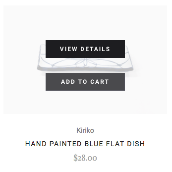
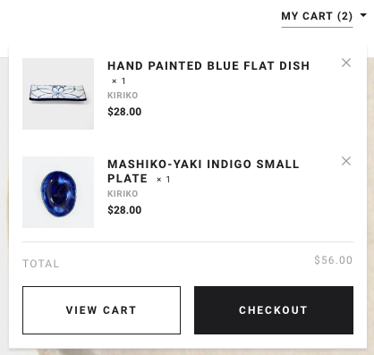

# Storefront Single-Page App

### Assignment
Using React*, create a single-page app which renders a mock storefront that matches the provided screenshots, using the
supplied JSON and media files. The `products.json` file should be accessed asynchronously by
making a GET request to `'/products.json'`
* The storefront consists of three main screens: a category list page, a product details page, and a cart page (plus cart popup). More details are provided below.
* Clicking the Add to Cart button on a product tile or on the product detail page should add the item to the cart
  dynamically.
* Attempting to add a duplicate item to the cart should instead increment the quantity for that item.
* It should be possible to change quantities and remove items on the cart page.
* Cart totals should update appropriately.

### Guidelines
* There is no time limit for this assignment but we would advise time boxing the exercise to 6-7 hours. 
* Submit your assignment as a Git repository hosted on either GitHub or BitBucket.
* Explain any compromises/shortcuts you made due to time considerations.
* If you wish to use a framework other than React you are free to do so; we provide a React basis simply to expedite
  the assignment process.
  
### Assessment Criteria
We would like to see your skills as a developer. The criteria used to evaluate the assignment is as follows:
#### App (25%)
Your capacity to deliver software given a set of requirements. Should at least match requirements and be bug free. Feel free to make anything extra that you consider an improvement on the requirements, but is not required.
#### Code (20%)
Your capacity for writing clean, maintainable, reusable and extensible code. Some of the things we will looking at are: software design, edge case handling, code complexity and code readability.
#### JavaScript (20%)
Your understanding of JavaScript, appropriate use of modern language features, framework mastery and appropriate use of JS libraries.
#### Unit Testing (20%)
* We don't ask for 100% code coverage, however we would like you to showcase your unit test skills. Choose different type of files and provide unit tests that showcase your unit testing capacity.
* Also, we would like to see your capacity for providing comprehensive testing for at least one component/module. Choose one  that you think is a good candidate for unit testing, and test it thoroughly.
Note: provide instructions on how to run them.
#### UI (15%)
* UI that matches requirements, properly aligned, responds to resizing properly (don't need to provide mobile version).
* UX: we would like to see some feedback when the user interacts with the website.
* CSS: we want to assess your skills writing readable, simple and maintainable CSS.

### Sample Screens
#### Category List page:

* Clicking the My Cart link should display the Cart Popup.
* Hovering over one of the product tiles should display an overlay prompting the user to Add to Cart or View Details,
  as below:



#### Cart Popup:

* You should be able to remove items from the cart using the popup.
* The View Cart button should take you to the cart page.
* The Checkout button does not need to do anything.
* When the popup is displayed, clicking anywhere outside it on the page should dismiss the popup.

#### Product details page:

* Clicking the My Cart link should display the Cart Popup.
* The quantity buttons should work as expected.
* Clicking Add to Cart should work as expected.

#### Cart page:

* Clicking the My Cart link should display the Cart Popup.
* The quantity buttons should work as expected, including updating the total for each line item and the cart total.
* The remove buttons should work as expected.
* The Continue Shopping link should return to the homepage.
* The Checkout button does not need to do anything.

### Instructions
This assignment requires [Node 6+](https://nodejs.org/en/) and was created using
[create-react-app](https://github.com/facebook/create-react-app).

Once installed, you should install the dependencies by running
```
npm install
```

To serve the application, run
```
npm start
```

To run the test suite, run
```
npm test
```
